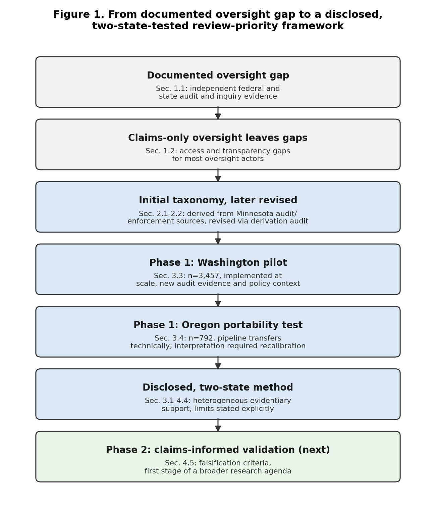
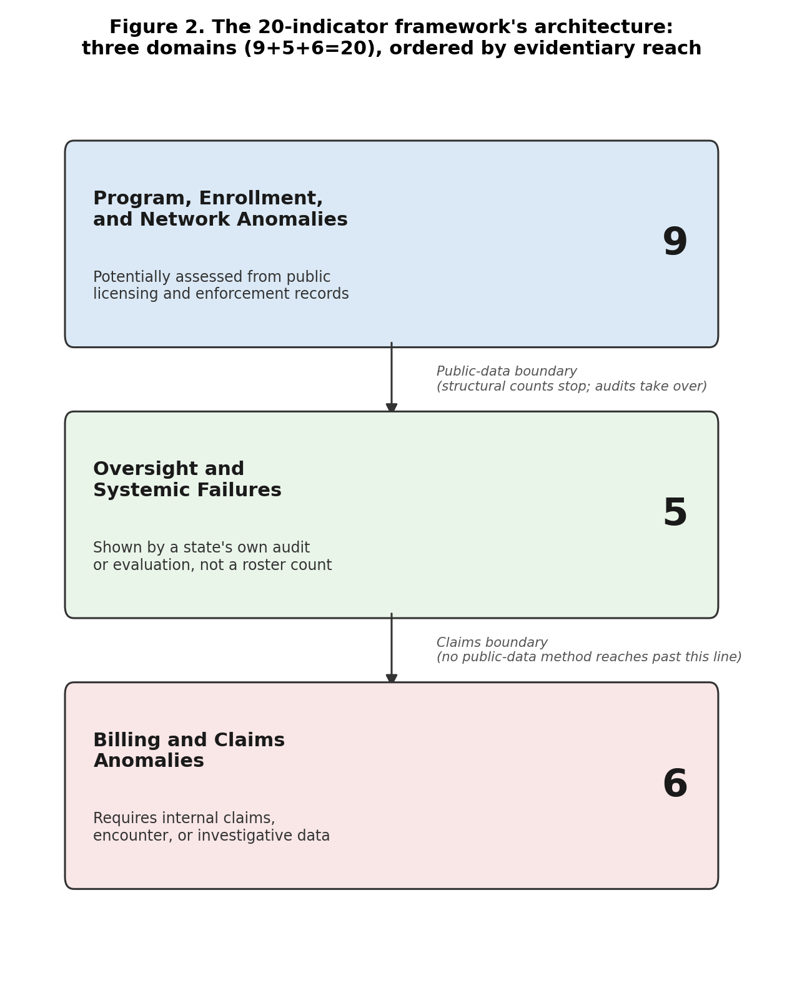
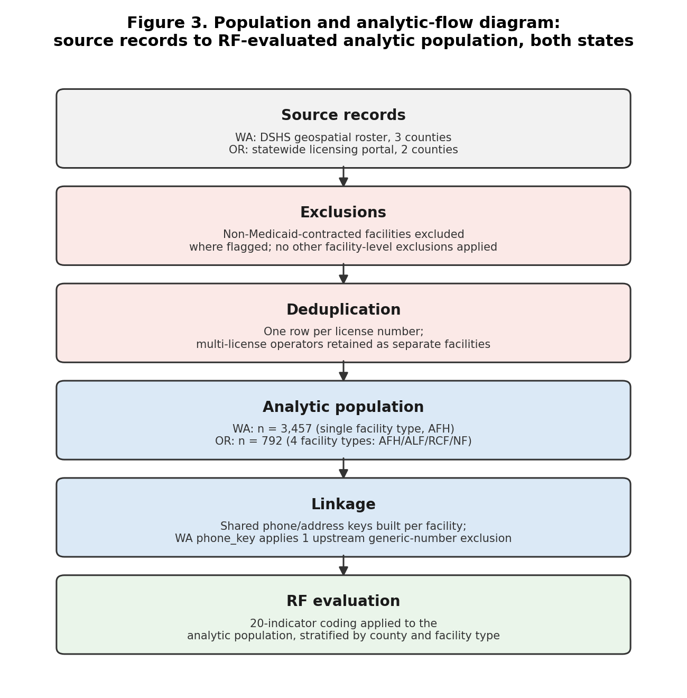

# Transparent Public-Data Prioritization for Medicaid Long-Term-Care Oversight: Evidence From Two States

Mohamed Noor Hussein

Independent Researcher, Medicaid Program Integrity and Long-Term Care Data Analytics

**Author Note**

This manuscript is a working paper, dated July 14, 2026, and has not undergone peer review. It extends the author's Washington working paper (Hussein, 2026a) by reporting a new Oregon portability analysis and adding a Washington federal audit and new congressional policy context absent from that earlier paper. Related preprints and replication materials are disclosed in the Declarations section below and in the cover letter. Correspondence: Mohamed Noor Hussein, Spokane Valley, Washington, United States, mohamednh954@gmail.com

## Abstract

**Background:** Publicly reproducible methods for prioritizing Medicaid long-term-care oversight are limited. **Objective:** This study evaluates whether public administrative records can support a transparent first review-priority layer and examines which aspects of such a method transfer across state regulatory systems. **Methods:** An initial 20-indicator taxonomy, generated from three documents spanning two Minnesota documentary lineages, was audited for source support, applied to Washington's Adult Family Homes (n = 3,457) and Oregon's four licensed care types (n = 792), and evaluated across six validity dimensions: source, content, measurement, population, threshold, and predictive. **Results:** The audit retired one contradicted indicator, split two into distinct subconstructs, and an external search corroborated seven indicators nationally while flagging two for retirement after locating no qualifying corroborating evidence under the prespecified search. In Washington, 72 shared-contact clusters covered 164 of 3,457 facilities (4.7%), and 165 (4.8%) carried an enforcement action. In Oregon, the pipeline reproduced technically, but the same rule produced a different result across a different population, localized to one facility type, independent of phone-based measurement. **Conclusion:** Public records can support a disclosed first layer of Medicaid review prioritization, but construct, measurement, population, and threshold validity must be examined separately before cross-jurisdiction transfer.

Keywords: Medicaid program integrity; Adult Family Homes; home and community-based services; public administrative data; program-integrity transparency; cross-state policy transfer; long-term care oversight; risk-based auditing.

Disclaimer: No Washington or Oregon facility or operator is alleged to have committed fraud. All indicators reported in this study are review-priority signals only, not findings of wrongdoing.

Teaser text: Publicly reproducible methods for prioritizing Medicaid long-term-care oversight are limited. An initial taxonomy derived from documented Minnesota audit and enforcement records, revised through its own source audit (one indicator retired, two split) and an external corroboration search, was tested in two states, showing transparent public-data review-priority analytics are technically feasible while revealing where state-specific recalibration is necessary.

**Key Takeaways**

- Public administrative records can provide a transparent first layer for Medicaid review prioritization while clearly stating, indicator by indicator, what public data can and cannot establish.
- Cross-state testing showed the method's computational pipeline is portable across heterogeneous regulatory systems, while identifying where facility-type-specific recalibration is required.
- Public-data review-priority analytics complements rather than replaces claims-informed Medicaid oversight, extending structured review capability to legislators, journalists, and other actors without routine or authorized claims access.

---

## 1. Introduction

Medicaid long-term care oversight faces a documented gap between expanding, dispersed provider networks and the capacity of existing inspection and claims-review systems. This study evaluates whether transparent public-data analytics can provide a reproducible first layer of review prioritization without being mistaken for a fraud determination.

Alt text: Flowchart with seven stages showing the manuscript's argument in sequence: a documented oversight gap, supported by independent federal and state audit and inquiry evidence; the access and transparency gap left by claims-only oversight; an initial 20-indicator taxonomy generated from Minnesota audit and enforcement sources across three evidentiary domains, then revised through a derivation audit that retired one indicator and split two others; the Washington pilot, implemented at scale with new audit evidence and policy context; the Oregon portability test, where the pipeline transferred technically and one threshold required recalibration; the resulting disclosed, two-state method with heterogeneous evidentiary support and limits stated explicitly; and claims-informed validation as a future Phase 2 step and the first stage of a broader research agenda.

### 1.1 The oversight problem

Independent federal and state records document capacity and oversight problems in both study states. A federal audit found 17 of 20 sampled Washington Adult Family Homes out of compliance with health-and-safety requirements (Section 3.3; U.S. Department of Health and Human Services, Office of Inspector General, 2024). Oregon's state-commissioned licensing review found survey-timeliness compliance as low as 8% for one facility type and a complaint-investigation backlog exceeding 4,000 cases (Oregon Department of Human Services, 2025a, 2025b). In March 2026, a congressional inquiry asked ten states, including Washington and Oregon, to detail their Medicaid program-integrity controls and specifically named home- and community-based services (U.S. House Committee on Energy and Commerce, 2026). CMS's 2026 funding deferrals against Minnesota and California, totaling more than $1.6 billion using a partly undisclosed statistical-outlier methodology (Kaiser Family Foundation, 2026; Section 4.1), further show Medicaid program integrity is an active federal policy priority. Together, these records place both study states within an active national program-integrity debate, the question Section 1.3 states precisely.

### 1.2 Why public-data review priority?

The gap is structural. Medicaid residential care is delivered through thousands of dispersed sites that states cannot inspect continuously, so oversight often begins after a complaint rather than through proactive risk prioritization, consistent with the broader program-integrity and regulatory-fragmentation literature (Hinton et al., 2025; Kohn & Pilaar, 2026). Claims and encounter data needed to assess billing anomalies are held internally and are generally unavailable to external actors without statutory authorization or a data-use agreement (42 C.F.R. §§ 431.300–431.307) — including researchers, journalists, legislators, and any licensing agency lacking that specific authorization — for independent reproduction, even where an authorized agency uses the same data internally. Claims access alone would also not resolve delayed inspections or fragmented licensing records. Public-data review-priority analytics addresses that access and transparency gap without replacing claims review; it provides a disclosed starting point for deciding where additional inspection, records review, or claims analysis may be warranted.

### 1.3 Research question

This study asks whether a disclosed, publicly reproducible method can provide a first layer of Medicaid long-term-care review prioritization without being mistaken for a fraud determination, and whether such a method transfers across states without unacknowledged loss of validity.

### 1.4 Objectives and contributions

This study pursues that question in three steps, each reported with its own limits stated in advance: deriving a 20-indicator typology from Minnesota's documented audit and enforcement record, implementing it at scale in Washington's Adult Family Home sector, and testing its transfer, across the six validity dimensions defined in Section 2.6, in Oregon, a structurally different second state.

## 2. Data and Methods

### 2.1 Framework development

The 20-indicator typology this study applies is one instance of a general method class this manuscript calls public-data review-priority analytics: a method that grounds its constructs in documented enforcement, audit, or other authoritative evidence rather than relying solely on unreported expert judgment, discloses every threshold and construction rule, classifies indicators by evidentiary reach, and tests source, content, measurement, population, threshold, and predictive validity (Section 2.6) before treating an implementation as jurisdiction-independent. Washington and Oregon are this manuscript's two demonstrations of that class, not the class itself.

The initial taxonomy was generated from three documents spanning two Minnesota documentary lineages: the Office of the Legislative Auditor's 2009 evaluation of personal care assistance and its 2017 follow-up evaluation of home- and community-based services financial oversight, one lineage, since the 2017 report re-surfaces and updates several 2009 findings without independently re-establishing them; and the U.S. Department of Justice's May 2026 Minnesota health-care-fraud enforcement action, the second (Minnesota Office of the Legislative Auditor, 2009, 2017; U.S. Department of Justice, 2026); Supplementary Appendix E situates this case within Minnesota's and Oregon's broader statewide enforcement records. Two documentary lineages can generate a useful initial taxonomy; they cannot support a claim of comprehensiveness, and this study does not make one. Patterns documented through completed legal outcomes were treated as established for construct-derivation purposes; patterns appearing only in pending charges were treated as documented but unproven. The corpus was coded iteratively by the author, then audited construct by construct against the source documents for an exact quotable passage; Section 3.1 reports what that audit found. The corpus produced three domains: nine program, enrollment, and network anomalies; five oversight and systemic failures; and six billing and claims anomalies requiring internal data. The count reflects the distinct constructs the record contained, not a predetermined target.

### 2.2 Twenty-indicator typology

The domains are ordered by evidentiary reach: nine program, enrollment, and network indicators can potentially be assessed from licensing and enforcement records; five oversight-system indicators are principally assessed through audits or system evaluations rather than facility-level roster counts (why Sections 3.3–3.4 lean on audits for that domain); six billing indicators require claims, encounter, or investigative data. The architecture specifies not merely whether an indicator is observed, but what evidence would be required to assess it.

Alt text: Diagram showing the 20-indicator framework's three-domain architecture: nine program, enrollment, and network-anomaly indicators potentially assessable from public licensing and enforcement records; five oversight and systemic-failure indicators principally assessed through audits or system evaluations; and six billing and claims-anomaly indicators requiring internal claims or investigative data, with the boundary between publicly assessable and claims-dependent evidence marked between the domains.

Each retained construct's source status—direct support, abstraction, proxy status, absence of anchor support, or retirement—is disclosed in Appendix G rather than presumed uniform (Section 3.1), supporting source validity, not predictive validity (Section 2.6); whether indicators predict confirmed outcomes remains a Phase 2 research question, defined next.

### 2.3 Two-phase oversight model

The framework operates through a two-phase oversight model. Phase 1, which this study builds and tests, uses public licensing, inspection, enforcement, ownership, and network records to identify structural review-priority signals; it does not establish misconduct and should not support adverse action. Phase 2, not executed here, uses authorized claims and investigative data to evaluate whether those signals correspond to confirmed billing, service-delivery, or eligibility anomalies, providing testing that public records alone cannot. Existing oversight tools commonly begin with claims; this framework begins earlier, organizing publicly observable structural information before authorized claims review, or for actors without access to it at all.

### 2.4 Washington data

The typology was first operationalized at scale in Washington's Adult Family Home sector: three counties (n = 3,457 facilities), using the Washington Department of Social and Health Services' geospatial provider roster, the Residential Care Services enforcement portal, and Secretary of State corporate filings (Hussein, 2026a). King, Pierce, and Spokane — Washington's two largest Puget Sound counties plus its largest Eastern Washington county — were selected before any indicator was computed, for the tractability of an auditable, county-scoped enforcement-record scrape, not for statistical representativeness or a result already in hand. The pipeline performs merge and key normalization, shared-address and shared-telephone clustering, and indicator coding against the 20-indicator typology.

This manuscript adds two sources absent from the original Washington working paper: the HHS Office of Inspector General's compliance audit (Report A-09-23-02002, issued November 13, 2024), and a March 3, 2026 congressional letter sent to Washington and nine other states asking them to detail Medicaid program-integrity efforts with home- and community-based services named specifically (U.S. House Committee on Energy and Commerce, 2026).

### 2.5 Oregon data

The same core pipeline and initial numeric thresholds, applied after harmonizing Oregon's source fields to the Washington analytic schema, were tested on a structurally different second state: two counties (Clackamas and Washington County), across all four residential facility types Oregon licenses (n = 792 combined), using Oregon's public long-term-care licensing portal (Oregon Department of Human Services, 2026). A third candidate county was evaluated and excluded before any indicator was run: its Adult Foster Home program is, by statute, an independent licensing authority not required to report to the state portal used here, which would have produced a near-zero enforcement-prevalence artifact reflecting data non-observability rather than a real absence of enforcement, a reading Oregon's own 2025 licensing-unit evaluation independently corroborates (Supplementary Appendix C). This was a deliberate portability test: would an instrument built entirely from Minnesota's record and calibrated on Washington's single-facility-type population still function somewhere neither had shaped it? Neither county sample estimates facility-level prevalence statewide; both test only whether the pipeline and indicators function in a new setting, a narrower claim than a representative sample would support. Figure 3 traces the population and analytic-flow path common to both states, from source records through exclusions, deduplication, and linkage to the RF-evaluated analytic population.

Alt text: Flowchart with six stages: source records (Washington's geospatial roster, three counties; Oregon's statewide licensing portal, two counties); exclusions (non-Medicaid-contracted facilities where flagged); deduplication (one row per license number); analytic population (Washington n=3,457, single facility type; Oregon n=792, four facility types); linkage (shared phone/address keys, with Washington's phone key applying one upstream generic-number exclusion); and RF evaluation (20-indicator coding applied to the analytic population, stratified by county and facility type).

### 2.6 Six validity dimensions

This study distinguishes six validity questions rather than using "validated" as an undifferentiated label. **Source validity** asks whether a construct is accurately derived from the underlying audit or enforcement record. **Content validity** asks whether independent oversight literature or agency findings recognize the same vulnerability outside the derivation source. **Measurement validity** asks whether the specific public variable used adequately represents the construct. **Population validity** asks whether a construction rule means the same thing when applied to a different underlying population, distinct from whether its numeric threshold transfers. **Threshold validity** asks whether a specific numeric cutoff is justified in the population it is applied to. **Predictive validity** asks whether an indicator identifies independently confirmed outcomes. This study establishes elements of the first four dimensions for selected indicators; it does not establish predictive validity for any indicator. Population validity is its own dimension, separate from threshold validity, because Section 3.4 documents a case where a rule's meaning changed across a differently composed population independent of any threshold adjustment.

## 3. Results

### 3.1 Derivation audit

Reading both Minnesota anchor documents in full, rather than relying on their summary materials, changed the result: the 2009 report, reached only through the 2017 report's own citation of it, supplied the corpus's most specific findings, including a direct anchor for rapid provider growth a summary-level pass had missed. Of the 21 active analytic rows (19 non-retired original identifiers, two subsequently split), 12 have a directly quotable anchor passage, 4 rest on abstraction or weak indication, 4 have no anchor located (an absence of evidence, not evidence of absence), and 1, the shared-contact indicator, is an operational proxy not scored on this axis (Section 3.5). One indicator, spending growth disconnected from beneficiary growth, was retired outright: the 2009 report's own data show growth tracking recipients, the opposite of the construct's claim. Two indicators were divided once audit showed each bundled evidentially distinct claims: missing versus fabricated documentation, and sanction-history vocabulary versus continued participation despite an exclusion. Because this derivation audit was otherwise conducted by a single author, a second, independent coder was given only the three source documents and a blinded construct list, with no access to the original classification, and separately classified all 21 rows (Section 4.2); raw agreement was 59.1% (13 of 22, including the retired indicator). The second coder independently relocated the passages behind the fabricated-documentation and continued-participation corrections above, and located a further passage that corrected the unresolved-audit-findings indicator from abstraction to directly stated; all three were independently verified against the source text before acceptance. The complete derivation matrix, the second-coder comparison, and the audit rationale are in Supplementary Appendix G.

### 3.2 External corroboration

A prespecified, dated search protocol tested whether each indicator recurs independently of its Minnesota source, across federal agencies and five comparison states (California, Michigan, Oregon, Texas, Washington), grading sources on a three-tier hierarchy and five convergence outcomes that never treat a search-result summary as verified text (Supplementary Appendix H). Seven indicators reached independent Strong convergence (listed in Table 1) through independently collected, full-text-verified national HHS-OIG and GAO sources, including a program rolling up fourteen prior audits across ten or more states. Several found only cross-program, single-case, or below-tier (limited) support. Two, operator geographic concentration and out-of-state billing location, found no qualifying source anywhere and are flagged for retirement or narrower redefinition. Table 1 summarizes this; Appendix H reports source-by-source detail.

**[Table 1 near here]**

This table reports evidentiary role, not twenty equally validated indicators, and reports only independently verified evidence in its categories; every indicator in "Strong independent convergence" rests on a fully retrieved, page-cited primary source, not a search-result summary. The full registry (21 active analytic rows plus the retired indicator), including the specific source for every cell, is Supplementary Appendix G.

### 3.3 Washington implementation

Of the 3,457 facilities, 165 (4.8%) carried at least one public enforcement action (county- and severity-level detail in Supplementary Appendix F); shared-contact clustering identified 72 clusters spanning 164 facilities (4.7%); and 586 facilities (17.0%) had at least one complaint investigation. Coverage was not uniform: 1,287 facilities (37.2%), computed as facilities with zero total public documents of any kind, had no retrievable inspection, relicensing, complaint-investigation, or enforcement record within the study's available 2023–2026 public-record window. This is a limit on what an external analyst can observe, not evidence those facilities had no oversight history (Section 4.4; Supplementary Appendix F).

The HHS-OIG audit provides independent system-level evidence on a question the structural counts cannot answer: whether state oversight capacity was keeping pace. It sampled 20 licensed homes directly and found 17 out of compliance with at least one health-and-safety requirement, 19 with at least one administrative requirement, and 214 instances of noncompliance in total, attributed in part to relicensing inspections suspended during the pandemic and not fully resumed for as long as three years (U.S. Department of Health and Human Services, Office of Inspector General, 2024). The congressional letter places Washington's experience within a broader national inquiry rather than adding empirical evidence of its own (U.S. House Committee on Energy and Commerce, 2026). Additional, independently sourced Washington system-level audits are reported in full in Supplementary Appendix D.

### 3.4 Oregon transfer

Facility density, bed density, and retained-record prevalence reproduced technically. Pooled county estimates, however, concealed a substantial facility-type difference a single aggregate would have hidden entirely: disaggregated by facility type, using the same enforcement-record definition and denominator throughout, Adult Foster Home enforcement prevalence ran 8 to 12%, against 38 to 60% or higher for the other three types. Oregon's portal also retains a longer historical record than Washington's 2023–2026 window; these figures describe each state's own visible record, not directly comparable incidence rates, and no cross-state prevalence comparison is drawn given the unequal retention windows.

The same population problem recurred in the shared-contact indicator, and a newly reproducible threshold sweep localizes exactly where. At the three-or-more-license threshold calibrated on Washington's single-facility-type population, shared-telephone clustering flagged a single same-brand, multi-property arrangement in Oregon's mixed-type population rather than a corroborated undisclosed-operator network. Recomputing the rule across thresholds {2, 3, 4, 5} and Oregon's four facility types shows the threshold-3 signal is carried almost entirely by Residential Care Facilities (5 of 81, 6.2%) and not at all by Adult Foster Homes (0 of 629); restricting the comparison to the Adult Foster Home subset alone identified a pair-level pattern at a two-license threshold once facility type was held constant, a sensitivity result, not a validated threshold (Supplementary Appendix A). This is a population-validity finding (Section 2.6), distinct from threshold validity: the rule produced a different result because the population it was applied to was not the population it was calibrated on, independent of the cutoff chosen, and the adjustment was possible only because the threshold was disclosed and testable. A separate exploratory comparison illustrates the same lesson: an unadjusted enforcement-prevalence association reverses direction once facility-type composition is accounted for (Supplementary Appendix A), not a predictive finding.

Oregon's enforcement record separately documented two case-level constructs: an unauthorized-location billing pattern from a Clackamas County Adult Foster Home operator's guilty plea and sentencing (Oregon Department of Justice, 2025), and a falsified-documentation allegation in a pending federal indictment, a charge, not a conviction (U.S. Attorney's Office, District of Oregon, 2026). The billing case is related to, but does not corroborate, the out-of-state/impossible-location construct flagged for retirement above (Supplementary Appendix G). Oregon's own licensing-unit evaluation separately documented the reactive-oversight and capacity constraints already introduced in Section 1.1, with the full evaluation chronology in Supplementary Appendix C. Six constructs in the original architecture require claims, encounter, credential, or investigative data neither state's public records provide; two were nonetheless documented after the fact above, though neither could have been flagged by any public roster in advance (Supplementary Appendix B). Full classifications and replication materials are in the supplementary appendices and, for Oregon, a public repository (Hussein, 2026b).

### 3.5 Measurement and corroboration

Two further analyses test whether the shared-contact indicator's measurement is stable and whether its clusters correspond to genuine relationships, rather than treating either as settled by the fact that clustering ran successfully in both states. In Washington, 70 of 72 clusters (97.2%) had at least one administrative linkage beyond the shared phone number, though only 26 (36.1% of all 72) were corroborated through a source independent of the licensing system itself (Supplementary Appendix F). In Oregon, all 49 shared-telephone clusters were individually checked against the state's public business registry: 36 (73%) reflected an affiliation already visible in the facility names themselves, 11 (22%) not visible from the facility names at all were corroborated through registry evidence (8 through a common officer, owner, or manager; 2 through a common address only, kept analytically distinct since a shared address alone does not establish common control; 1 through outright common legal-entity identity), 1 (2%) yielded no corroborating public connection, and 1 (2%) remained indeterminate. The eleven non-obvious corroborations are the result that matters for the indicator's standing as an entity-resolution proxy; the one non-corroborated and one indeterminate cluster are why it requires case-level corroboration rather than standing alone as a review-priority finding (Supplementary Appendix H).

A linkage-robustness check found phone-based measurement fully stable in Oregon and, in Washington, stable once one pre-existing exclusion of a non-facility-specific contact number is correctly applied (50 facilities at the calibrated threshold, versus 53 if omitted, reported only as a sensitivity check, not measurement instability). Address-based linkage was not similarly stable: strict matching identified 59 Oregon facilities at the recalibrated threshold against 71 under lenient matching. Phone-based linkage is accordingly the more measurement-stable of the construct's two bases (Supplementary Appendix G).

## 4. Discussion

### 4.1 What this study establishes

A disclosed public-data method can be implemented at scale and tested for transfer across two differently structured state Medicaid long-term-care systems. Most construction rules, thresholds, and recalibration failures are disclosed and independently verifiable from the released de-identified package; the shared-contact indicator's identifier-level entity-resolution steps are the privacy-constrained exception, disclosed and verifiable in aggregate but not rerunnable against unreleased identifiers (Section 3.5). Seven indicators reached independent Strong convergence against a prespecified national search (Section 3.2), and the shared-contact indicator's clusters were individually checked against public registry evidence rather than assumed correct because the pipeline ran (Section 3.5). This matters beyond these two states: the CMS deferrals introduced in Section 1.1 make concrete why classifications with nine-figure fiscal consequences should be reviewable in principle, and why this study reports every recalibration and evidentiary gap rather than only its successes.

The framework's practical reach extends beyond agencies with claims access: legislators, journalists, and watchdog organizations frequently lack it, and for them public-data review priority is the primary structured layer available, not merely preliminary to claims analysis. Two independent GAO findings reinforce this at a definitional level: 26 of 48 state Medicaid agencies could not report critical-incident counts in assisted living, and assisted living is not uniformly identifiable across Medicare and Medicaid claims. A public ownership-linkage tool using the same shared-contact logic has already been applied downstream by journalists, and proposed Minnesota legislation targets the same concentration concern this study's indicators structure, though neither validates either indicator (Supplementary Appendix H).

### 4.2 What this study does not establish

This study does not establish that any indicator predicts confirmed fraud, that its thresholds hold nationally, or that a disclosed public-data method outperforms an agency's internal claims system, and it does not allege wrongdoing by any named facility or operator. The derivation audit (Section 3.1) was initially conducted by a single author; a second, independent human coder subsequently classified all 21 rows without seeing the original result, and the two agreed on 59.1% of rows. That figure, not a higher one, is reported: several remaining disagreements are genuine, unresolved interpretive differences about how directly a real passage supports a given construct, not something either coder's authority resolves. Two indicators completed a full search with no qualifying evidence and are flagged for retirement or narrower redefinition. None of this study's corroboration findings, however strong, substitutes for the claims-informed validation Section 4.5 specifies as the necessary next step.

### 4.3 Why Oregon matters

Oregon is this study's methodological centerpiece, not a secondary robustness check. The pipeline transferred technically without modification, which could have been reported as the whole result; it was not (Section 3.4). Technical reproducibility did not guarantee population validity, and population validity did not guarantee threshold validity. That failure and recovery, not the successful reproduction, is this study's strongest scientific lesson, consistent with the broader policy-transfer literature's caution that an instrument can run in a new setting without transferring its meaning (Dolowitz & Marsh, 2000): a method can run correctly in a new jurisdiction and still mean something different there, and only disclosure of the construction rule made that difference visible rather than silently absorbed into one reported number.

### 4.4 Why incompleteness matters

Washington's 1,287 facilities (37.2%) with no retrievable public document illustrate a general limit, not a Washington-specific one: public records are structurally incomplete, and this study does not treat that incompleteness as a defect to be argued away. Their value is relative accessibility and contestability across institutional boundaries that claims data, confined to a single agency, does not offer (Section 1.2). The 37.2% figure is the boundary of what an external analyst can currently observe, not evidence those facilities received no internal oversight. Oregon's longer retention window and different facility-type composition (Section 3.4) show this boundary is itself jurisdiction-specific and must be measured, not assumed.

### 4.5 Falsification and future testing

Consistent with Section 2.6, this study specifies in advance what would weaken it: its derivation, if an independent reviewer could not reconstruct the audit trail (Appendix G); its shared-contact indicator, if a broader cluster sample mostly reflected data artifacts rather than the mixture found here (Section 3.5); its portability claim, if a third state's construction failed to transfer even technically, unlike Oregon's technical transfer with recalibrated interpretation; and its practical and operational relevance, if claims-informed validation found no association with confirmed outcomes, or agency implementation improved neither review yield nor workload allocation. None of these tests has been run yet; that is this study's stated next step, not a gap it claims to have closed.

This framework should not support adverse action against a named facility or operator, replace claims-informed review before a funding or enforcement decision, generate a numeric fraud-risk score attached to a specific entity, publish rankings of named facilities, or be applied in a jurisdiction whose licensing portal lacks adequate retention or field completeness. It is a screening layer, not an adjudicator; every result reported here is a review-priority signal, never a finding.

## 5. Conclusion

Public records can support a disclosed first layer of Medicaid long-term-care review prioritization across two structurally different state systems, but construct support, measurement performance, population comparability, and threshold validity had to be examined separately, and were found not to transfer uniformly, before this study could say so. Washington established large-scale technical feasibility; Oregon showed that a technically reproducible construction can still mean something different in a differently composed population, this study's central lesson. Transparent oversight is not valuable because it guarantees better decisions; it is valuable because it allows the methods guiding those decisions to be independently examined, challenged, and improved, the same premise that underlies reproducibility's broader role in strengthening scientific and administrative claims (National Academies of Sciences, Engineering, and Medicine, 2019).

---

## Declarations

**Ethics Approval and Consent to Participate:** Not applicable. This study used exclusively publicly available, de-identified administrative and geospatial data, publicly available federal audit reports, and publicly available congressional correspondence. The study did not involve interaction with human participants, access to protected health information, or analysis of individual-level patient data.

**Consent for Publication:** Not applicable.

**Availability of Data and Materials:** The underlying source records were obtained from publicly available portals: the Washington DSHS Geospatial Open Data Portal, Oregon's long-term-care licensing portal (Oregon Department of Human Services, 2026), the HHS Office of Inspector General's public report archive, and the House Committee on Energy and Commerce's public correspondence. De-identified analytic datasets created by the author for both states, the combined evidentiary-classification matrix, and an independent verification script are provided directly in this manuscript's own public repository (Hussein, 2026c), and Washington's are additionally available in the companion Washington working paper's repository (Hussein, 2026a). Supplementary Appendices A–H, containing additional diagnostic and methodological detail, including the full derivation audit (Appendix G) and external corroboration crosswalk (Appendix H), are submitted alongside this manuscript as Supplementary Material and are also included in that same public repository.

**Acknowledgments:** Chrispin Nyakieni independently classified all 21 active constructs in the derivation audit (Section 3.1), blind to the author's original classification, as a second-coder reliability check; his contribution is limited to that classification task and does not extend to authorship of this manuscript.

**Competing Interests:** The author declares no competing interests.

**Funding:** This research received no specific grant from any funding agency in the public, commercial, or not-for-profit sectors.

**Use of Artificial Intelligence:** Generative AI tools were used to assist with literature retrieval, drafting, and editing of this manuscript under the author's direction; all factual claims and citations were checked by the author against primary sources before inclusion, and the author retained sole responsibility for all analysis, interpretation, and conclusions. All indicator classifications reported in this manuscript reflect the author's own derivation audit (Section 3.1); no classification decision was delegated to or determined by an AI system.

---

## List of Figures

- **Figure 1.** From documented oversight gap to a disclosed, two-state-tested review-priority framework (Section 1).
- **Figure 2.** The 20-indicator framework's architecture: three domains (9+5+6=20), ordered by evidentiary reach (Section 2.2).
- **Figure 3.** Population and analytic-flow diagram: source records to RF-evaluated analytic population, both states (Section 2.5).

Table 1 (Section 3.2) is this manuscript's fourth main-text table/figure item. All three figures are generated programmatically from this manuscript's own data and argument structure, not hand-drawn; generation scripts are provided in the project repository for reproducibility.

---

## Table

**Table 1. Evidentiary status of the framework's indicators, by evidentiary role**

| Category | Indicators | Current evidence | What the evidence establishes |
|---|---|---|---|
| Strong independent convergence | Excluded-party evasion; continued participation despite exclusion; ineligible/deceased-beneficiary billing; incomplete managed-care payment data; unactioned provider-fraud referrals; missing documentation; unresolved audit findings | Multiple independently verified, full-text-read national datasets/audit programs | Mechanism recurs independently of the derivation source |
| Limited or related convergence | Concealed ownership; questionable address; cloned documentation; stolen credentials; reactive oversight | Cross-program, single-jurisdiction, or below-tier support | Plausibility, not independent confirmation |
| Anchor-derived only | Provider/facility growth; multi-facility concentration; impossible-hours billing; maximum-unit billing; program-design vulnerability | Directly quotable Minnesota passage, no independently verified external match | Source validity, not external convergence |
| Operational proxy | Shared-contact clustering | WA/OR clustering plus Oregon registry corroboration (Section 3.5) | Measurement utility requiring case-level corroboration |
| Unsupported, redefined, or retired | Spending-growth construct (retired); out-of-state operator; out-of-state billing location | Contradicted by source data, or no evidence in a completed search | Framework revision required |

*Referenced in Section 3.2, placed here per journal convention (editable tables at manuscript end, not embedded in Results).*

---

## References

Centers for Medicare & Medicaid Services. (2026a, February 25). *Minnesota Medicaid deferral notice*. U.S. Department of Health and Human Services.

Centers for Medicare & Medicaid Services. (2026b, May 13). *California Medicaid deferral notice*. U.S. Department of Health and Human Services.

Dolowitz, D. P., & Marsh, D. (2000). Learning from abroad: The role of policy transfer in contemporary policy-making. *Governance, 13*(1), 5–23. https://doi.org/10.1111/0952-1895.00121

Financial Crimes Enforcement Network. (2026, March 30). *FinCEN advisory on health care fraud schemes targeting Medicare, Medicaid, and other federal and state health care benefit programs* (FIN-2026-A001). U.S. Department of the Treasury. https://www.fincen.gov/system/files/2026-03/FinCEN-Advisory-Health-Care-Fraud.pdf

Governor Kotek, T. (2026, March). *Governor Kotek refutes misleading claims about Oregon Health Plan, highlights aggressive fraud prevention and recovery efforts* [Press statement]. State of Oregon Newsroom. https://apps.oregon.gov/oregon-newsroom/OR/GOV/Posts/Post/governor-kotek-refutes-misleading-claims-about-oregon-health-plan-highlights-aggressive-fraud-prevention-and-recovery-efforts

Hinton, E., Mathers, J., & Rudowitz, R. (2025, March 18). *5 key facts about Medicaid program integrity: Fraud, waste, abuse and improper payments*. KFF. https://www.kff.org/medicaid/5-key-facts-about-medicaid-program-integrity-fraud-waste-abuse-and-improper-payments/

Hussein, M. N. (2026a). *A public-data review-priority framework for Medicaid residential care oversight: Evidence from Washington State Adult Family Homes* [Working paper]. SSRN. https://papers.ssrn.com/sol3/papers.cfm?abstract_id=7070198

Hussein, M. N. (2026b). *Can public long-term-care oversight methods travel across states? A two-county Oregon cross-state applicability study* [Data set and replication package]. GitHub. https://github.com/Mohamedn954/public-data-review-priority-oregon-public

Hussein, M. N. (2026c). *Public-data review-priority analytics for Medicaid long-term care oversight: Washington and Oregon* [Data set and replication package]. GitHub. https://github.com/Mohamedn954/public-data-review-priority-multistate-public

Kaiser Family Foundation. (2026). *What to know about recent federal actions involving state Medicaid program integrity*. KFF. https://www.kff.org/medicaid/what-to-know-about-recent-federal-actions-involving-state-medicaid-program-integrity/

Kohn, N. A., & Pilaar, M. (2026). Decontractualizing assisted living. *SSRN Electronic Journal*. https://doi.org/10.2139/ssrn.6731699

Minnesota Office of the Legislative Auditor. (2009). *Personal care assistance* [Evaluation report]. https://www.auditor.leg.state.mn.us/ped/pedrep/pca.pdf

Minnesota Office of the Legislative Auditor. (2017). *Home- and community-based services: Financial oversight* [Evaluation report]. https://www.auditor.leg.state.mn.us/ped/2017/hcbssum.htm

National Academies of Sciences, Engineering, and Medicine. (2019). *Reproducibility and replicability in science*. The National Academies Press. https://doi.org/10.17226/25303

Oregon Department of Human Services. (2025a, February). *Safety, Oversight, and Quality Unit rapid response report* [Independent evaluation prepared by Alvarez and Marsal]. https://www.oregon.gov/odhs/licensing/apd/Documents/rapid-response-report-2025.pdf

Oregon Department of Human Services. (2025b, June 30). *SOQ assessment* [Independent evaluation prepared by Alvarez and Marsal]. https://www.oregon.gov/odhs/licensing/apd/Documents/soq-assessment-final-report-2025.pdf

Oregon Department of Human Services. (2026). *Long term care licensing information* [Data portal]. https://ltclicensing.oregon.gov

Oregon Department of Justice. (2025, July 3). *Adult foster home owner pleads guilty to neglect and theft charges involving Medicaid recipients* [Press release]. https://www.doj.state.or.us/media-home/news-media-releases/adult-foster-home-owner-pleads-guilty-to-neglect-and-theft-charges-involving-medicaid-recipients/

Oregon Department of Justice. (2026). *Medicaid Fraud Unit enforcement record summary*. https://www.doj.state.or.us/media-home/news-media-releases/ag-rayfield-highlights-strong-record-recent-enforcement-actions-in-combatting-medicaid-fraud-and-abuse/

State of Washington, Office of Financial Management. (2026). *Single audit report for the fiscal year ended June 30, 2025*. https://ofm.wa.gov/wp-content/uploads/2026/03/SingleAuditReport2025.pdf

U.S. Attorney's Office, District of Oregon. (2026, January 27). *Oregon mother and daughter facing new charges related to forced labor and health care fraud* [Press release]. U.S. Department of Justice. https://www.justice.gov/usao-or/pr/oregon-mother-and-daughter-facing-new-charges-related-forced-labor-and-health-care-fraud

U.S. Department of Health and Human Services, Office of Inspector General. (2024, November 13). *Washington State's oversight could better ensure that Adult Family Homes comply with health and safety and administrative requirements* (A-09-23-02002). https://oig.hhs.gov/reports/all/2024/washington-states-oversight-could-better-ensure-that-adult-family-homes-comply-with-health-and-safety-and-administrative-requirements/

U.S. Department of Health and Human Services, Office of Inspector General. (2025, February 20). *Office of Inspector General's partnership with the Office of the Washington State Auditor: State Auditor's report examining Washington's concurrent Medicaid enrollments* (A-09-23-02009). https://oig.hhs.gov/reports/all/2025/office-of-inspector-generals-partnership-with-the-office-of-the-washington-state-auditor-state-auditors-report-examining-washingtons-concurrent-medicaid-enrollments/

U.S. Department of Justice. (2026, May 21). *Minnesota health care fraud takedown results in charges against 15 defendants in over $90M fraud* [Press release]. https://www.justice.gov/opa/pr/minnesota-health-care-fraud-takedown-results-charges-against-15-defendants-over-90m-fraud

U.S. House Committee on Energy and Commerce. (2026, March 3). *E&C leaders expand investigation into Medicaid fraud nationwide* [Press release]. https://energycommerce.house.gov/posts/e-and-c-leaders-expand-investigation-into-medicaid-fraud-nationwide

Washington State Auditor's Office. (2021, July 8). *Medicaid program integrity: Health Care Authority division of program integrity* [Performance audit]. https://sao.wa.gov/reports-data/audit-reports/medicaid-program-integrity

Washington State Auditor's Office. (2023, October 31). *Medicaid managed care organizations program integrity efforts* [Performance audit]. https://sao.wa.gov/reports-data/audit-reports/medicaid-managed-care-organizations-program-integrity-efforts

Washington State Auditor's Office. (2026). *Assessing vendor spending growth at the Department of Social and Health Services* [Performance audit, work in progress]. https://sao.wa.gov/performance-audits/performance-audits-progress

---

*Eight supplementary appendices (A–H) accompany this manuscript as Supplementary Material: see Hussein_Multistate_Manuscript_Supplementary.md / .docx / .pdf.*
